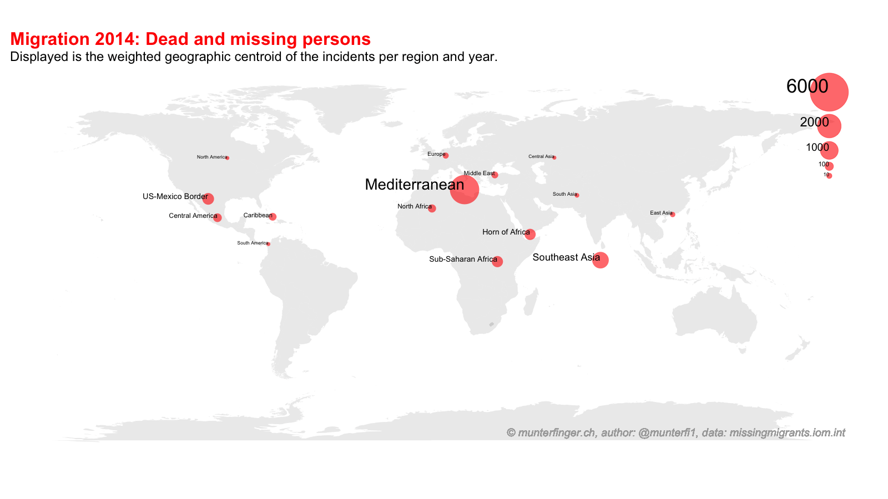

# Missing Migrants (2014-2019)

Description of the data set by Missingmigrants.iom.int (2020): *“Missing Migrants Project tracks deaths of migrants, including refugees and asylum-seekers, who have died or gone missing in the process of migration towards an international destination. Please note that these data represent minimum estimates, as many deaths during migration go unrecorded.”*

### Pkgs
``` r
install.packages("data.table")
install.packages("ggplot2")
install.packages("gganimate")
install.packages("maps")
install.packages("sf")
```

### Funcs
``` r
source("R/prep_data.R") 
source("R/anim_plot.R")
source("R/write_anim.R") 
```

### Read & preprocess
``` r
mig <- prep_data("data/MissingMigrants-Global-2020-01-08T14-05-32.csv")
```

### Create map
``` r
title <- 
  'Migration {frame_time}: Dead and missing persons'
subtitle <- 
  "Displayed is the geographic centroid of the incidents per region and year."
caption <- 
  "© munterfinger.ch, author: @munterfi1, data: missingmigrants.iom.int"
gplot <- anim_plot(mig,title, subtitle, caption)
```

### Save animation
``` r
gplot %>% write_anim("docs/migration_%s_%s.gif")
```

## References
* Missingmigrants.iom.int. (2020). Missing Migrants Project. [online] Available at: https://missingmigrants.iom.int/downloads [Accessed 11 Jan. 2020].

## License
* IOMs [Missing Migrants Project data](https://missingmigrants.iom.int/downloads) is licensed under a [Creative Commons Attribution 4.0 International License](https://creativecommons.org/licenses/by/4.0/).
* This repository is licensed under the GNU General Public License v3.0 - see the [LICENSE](LICENSE) file for details.